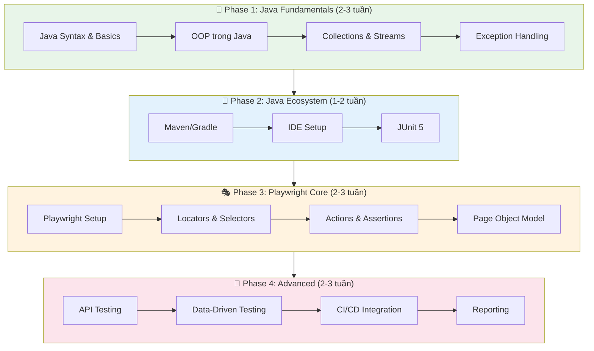
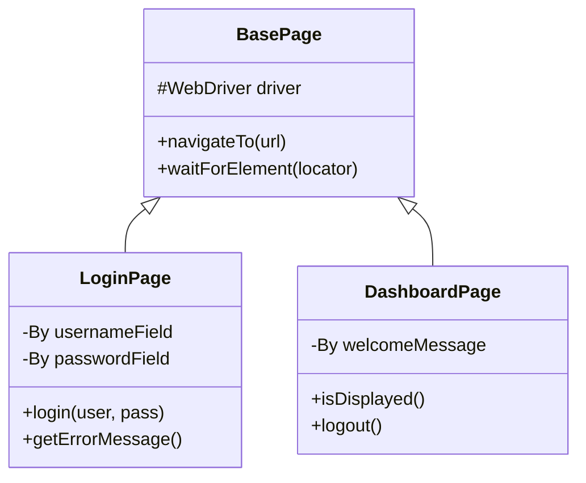
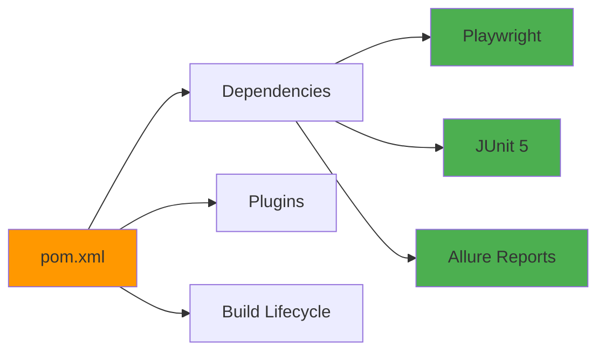
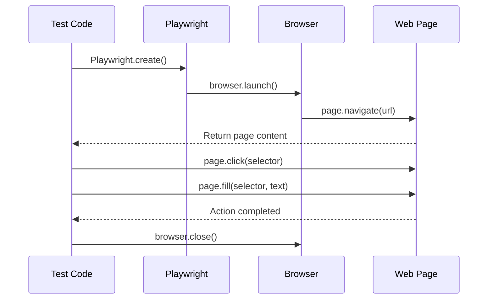
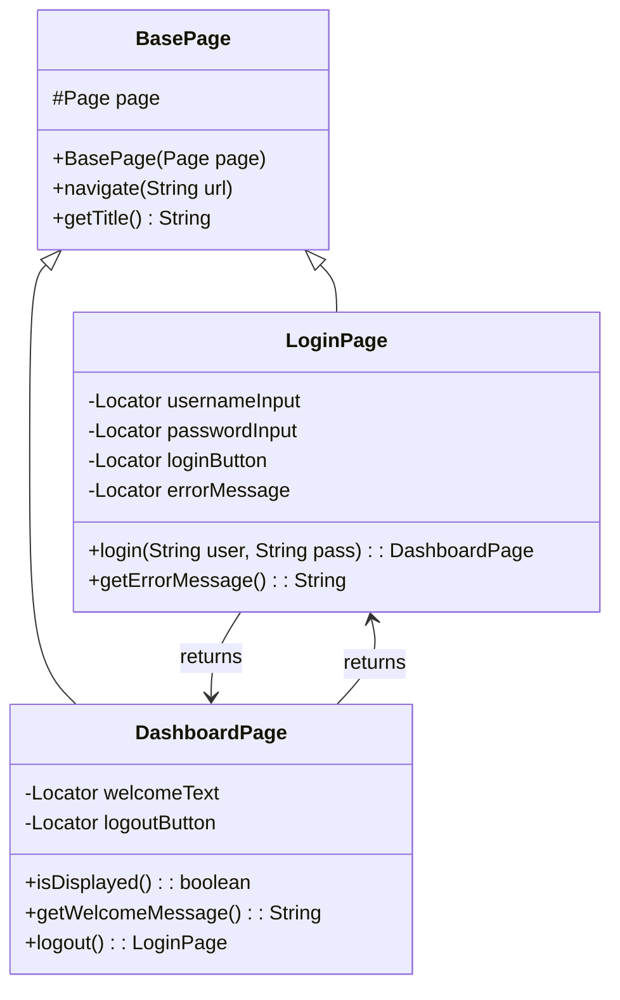
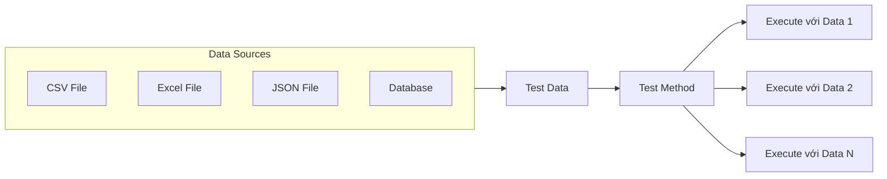
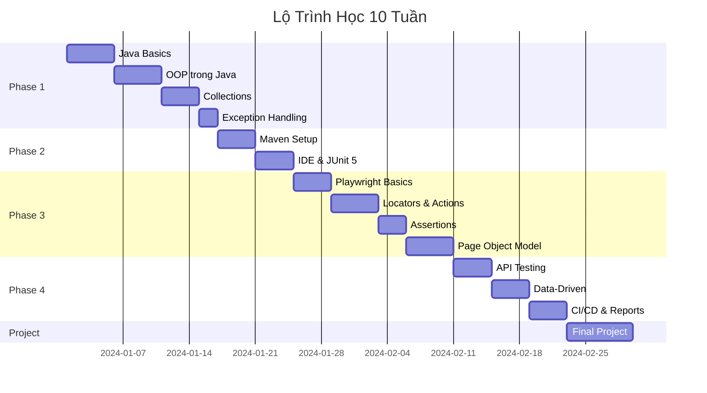

# Lộ Trình Học Java Playwright Automation Testing

> **Mục tiêu**: Từ người đã biết OOP, Database, HTML/CSS/JS → Đạt trình độ Junior Automation Tester với Java Playwright
> 
> **Thời gian dự kiến**: 8-12 tuần (học 2-3 giờ/ngày)

---

## 📊 Tổng Quan Lộ Trình



---

## 🎯 Phase 1: Java Fundamentals (2-3 tuần)

### Mục tiêu
Nắm vững nền tảng Java cần thiết cho automation testing. Vì bạn đã biết OOP từ ngôn ngữ khác, phase này sẽ tập trung vào syntax đặc thù của Java.

### 1.1 Java Syntax & Basics (3-4 ngày)

| Chủ đề | Kiến thức cần nắm | Ưu tiên |
|--------|-------------------|---------|
| **Variables & Data Types** | `int`, `String`, `boolean`, `double`, `var` | ⭐⭐⭐ |
| **Operators** | Arithmetic, Comparison, Logical | ⭐⭐⭐ |
| **Control Flow** | `if/else`, `switch`, `for`, `while`, `for-each` | ⭐⭐⭐ |
| **Arrays** | Declaration, initialization, iteration | ⭐⭐⭐ |
| **Methods** | Parameters, return types, overloading | ⭐⭐⭐ |

**📚 Tài liệu học:**
- [W3Schools Java Tutorial](https://www.w3schools.com/java/) - Cơ bản, dễ hiểu
- [Java Documentation](https://docs.oracle.com/javase/tutorial/) - Chính thức từ Oracle

**💻 Bài tập thực hành:**
```java
// Ví dụ: Tạo method kiểm tra valid email
public boolean isValidEmail(String email) {
    return email != null && email.contains("@") && email.contains(".");
}
```

### 1.2 OOP trong Java (4-5 ngày)



| Chủ đề | Chi tiết | Áp dụng trong Automation |
|--------|----------|--------------------------|
| **Class & Object** | Constructor, fields, methods | Page Objects |
| **Encapsulation** | `private`, `public`, `protected`, getters/setters | Data hiding trong test |
| **Inheritance** | `extends`, `super`, method overriding | Base Page class |
| **Polymorphism** | Interface, abstract class | Test abstraction |
| **Composition** | Has-a relationship | Page components |

### 1.3 Collections Framework (3-4 ngày)

| Collection | Use Case trong Testing | Ví dụ |
|------------|------------------------|-------|
| `List<String>` | Lưu danh sách test data | Dropdown options |
| `Map<String, String>` | Key-value pairs | Config, credentials |
| `Set<String>` | Unique values | Validate no duplicates |

**Code mẫu:**
```java
// Sử dụng List cho test data
List<String> testUsers = Arrays.asList("user1", "user2", "admin");

// Sử dụng Map cho credentials
Map<String, String> loginData = new HashMap<>();
loginData.put("username", "testuser");
loginData.put("password", "secret123");
```

### 1.4 Exception Handling (2 ngày)

```java
// Pattern thường dùng trong automation
try {
    page.click("#submit-button");
} catch (TimeoutException e) {
    System.out.println("Element not found: " + e.getMessage());
    // Screenshot hoặc logging
} finally {
    // Cleanup code
}
```

> [!TIP]
> **Checkpoint Phase 1**: Bạn nên có thể viết một chương trình Java console đơn giản với OOP trước khi sang Phase 2.

---

## 🔧 Phase 2: Java Ecosystem & Testing Tools (1-2 tuần)

### 2.1 Build Tools: Maven (3-4 ngày)



**Kiến thức cần nắm:**
- Cấu trúc file `pom.xml`
- Dependency management
- Maven lifecycle: `clean`, `compile`, `test`, `package`
- Commands: `mvn clean test`, `mvn install`

**pom.xml mẫu cho Playwright:**
```xml
<dependencies>
    <dependency>
        <groupId>com.microsoft.playwright</groupId>
        <artifactId>playwright</artifactId>
        <version>1.40.0</version>
    </dependency>
    <dependency>
        <groupId>org.junit.jupiter</groupId>
        <artifactId>junit-jupiter</artifactId>
        <version>5.10.0</version>
        <scope>test</scope>
    </dependency>
</dependencies>
```

### 2.2 IDE Setup: IntelliJ IDEA (1 ngày)

**Cài đặt cần thiết:**
- [ ] IntelliJ IDEA Community Edition (miễn phí)
- [ ] JDK 17 hoặc 21 (LTS versions)
- [ ] Maven integration
- [ ] Plugins: SonarLint, Playwright Test

**Keyboard shortcuts quan trọng:**
| Shortcut | Action |
|----------|--------|
| `Ctrl + Space` | Autocomplete |
| `Ctrl + Shift + F10` | Run current test |
| `Ctrl + Alt + L` | Format code |
| `Ctrl + Click` | Go to definition |

### 2.3 JUnit 5 Fundamentals (3-4 ngày)

```java
import org.junit.jupiter.api.*;
import static org.junit.jupiter.api.Assertions.*;

class LoginTests {
    
    @BeforeAll
    static void setupAll() {
        // Chạy 1 lần trước tất cả tests
    }
    
    @BeforeEach
    void setup() {
        // Chạy trước mỗi test
    }
    
    @Test
    @DisplayName("Login với credentials hợp lệ")
    void testValidLogin() {
        // Test code
        assertTrue(isLoggedIn);
    }
    
    @Test
    @Disabled("Tạm skip - chờ fix bug #123")
    void testInvalidLogin() {
        // Skipped test
    }
    
    @AfterEach
    void teardown() {
        // Cleanup sau mỗi test
    }
}
```

**Assertions thường dùng:**
| Assertion | Mục đích |
|-----------|----------|
| `assertEquals(expected, actual)` | So sánh giá trị |
| `assertTrue(condition)` | Kiểm tra điều kiện đúng |
| `assertNotNull(object)` | Kiểm tra không null |
| `assertThrows(Exception.class, () -> {})` | Kiểm tra exception |

---

## 🎭 Phase 3: Playwright Core (2-3 tuần)

### 3.1 Playwright Setup & Basics (3-4 ngày)



**Setup cơ bản:**
```java
import com.microsoft.playwright.*;

public class FirstTest {
    public static void main(String[] args) {
        try (Playwright playwright = Playwright.create()) {
            Browser browser = playwright.chromium().launch(
                new BrowserType.LaunchOptions().setHeadless(false)
            );
            Page page = browser.newPage();
            page.navigate("https://example.com");
            
            System.out.println(page.title());
            
            browser.close();
        }
    }
}
```

### 3.2 Locators & Selectors (4-5 ngày)

```mermaid
mindmap
  root((Locators))
    CSS Selectors
      #id
      .class
      [attribute]
      tag
    XPath
      //tag
      //*[@id]
      contains()
    Playwright Built-in
      getByRole()
      getByText()
      getByLabel()
      getByTestId()
```

**Bảng so sánh Locators:**

| Loại | Ví dụ | Ưu điểm | Khi nào dùng |
|------|-------|---------|--------------|
| **getByRole** | `getByRole(AriaRole.BUTTON, new Locator.GetByRoleOptions().setName("Submit"))` | Accessible, stable | Ưu tiên #1 |
| **getByTestId** | `getByTestId("login-btn")` | Rất stable | Khi có data-testid |
| **getByText** | `getByText("Login")` | Dễ đọc | Text cố định |
| **CSS** | `locator("#submit")` | Nhanh | ID hoặc class rõ ràng |
| **XPath** | `locator("//button[text()='Login']")` | Linh hoạt | Complex structures |

**Best Practices:**
```java
// ✅ Tốt - Sử dụng role-based locator
page.getByRole(AriaRole.BUTTON, 
    new Page.GetByRoleOptions().setName("Submit")).click();

// ✅ Tốt - Sử dụng test ID
page.getByTestId("login-button").click();

// ⚠️ Tránh - Selector quá fragile
page.locator("body > div:nth-child(3) > button").click();
```

### 3.3 Actions & Interactions (3-4 ngày)

| Action | Code | Ghi chú |
|--------|------|---------|
| **Click** | `page.click("#btn")` | Tự động wait |
| **Fill** | `page.fill("#input", "text")` | Clear trước khi fill |
| **Type** | `page.type("#input", "text")` | Gõ từng ký tự |
| **Select** | `page.selectOption("#dropdown", "value")` | Dropdown |
| **Check** | `page.check("#checkbox")` | Checkbox |
| **Hover** | `page.hover("#element")` | Mouse hover |
| **Upload** | `page.setInputFiles("#file", Path.of("file.pdf"))` | File upload |

**Waits:**
```java
// Auto-waiting (mặc định)
page.click("#button"); // Tự động đợi element

// Explicit wait
page.waitForSelector("#loading", 
    new Page.WaitForSelectorOptions().setState(WaitForSelectorState.HIDDEN));

// Wait for navigation
page.waitForURL("**/dashboard");

// Wait for response
page.waitForResponse(response -> 
    response.url().contains("/api/login") && response.status() == 200,
    () -> page.click("#submit"));
```

### 3.4 Assertions (2-3 ngày)

```java
import static com.microsoft.playwright.assertions.PlaywrightAssertions.assertThat;

// Element assertions
assertThat(page.locator("#message")).isVisible();
assertThat(page.locator("#message")).hasText("Welcome!");
assertThat(page.locator("#message")).containsText("Welcome");
assertThat(page.locator("#input")).hasValue("default");

// Page assertions
assertThat(page).hasTitle("Dashboard");
assertThat(page).hasURL(Pattern.compile(".*dashboard.*"));

// State assertions
assertThat(page.locator("#button")).isEnabled();
assertThat(page.locator("#checkbox")).isChecked();
```

### 3.5 Page Object Model (4-5 ngày)



**Cấu trúc thư mục:**
```
src/
├── main/java/
│   └── pages/
│       ├── BasePage.java
│       ├── LoginPage.java
│       └── DashboardPage.java
└── test/java/
    └── tests/
        ├── BaseTest.java
        └── LoginTests.java
```

**BasePage.java:**
```java
public abstract class BasePage {
    protected final Page page;
    
    public BasePage(Page page) {
        this.page = page;
    }
    
    public String getTitle() {
        return page.title();
    }
    
    protected void click(Locator locator) {
        locator.click();
    }
    
    protected void fill(Locator locator, String text) {
        locator.fill(text);
    }
}
```

**LoginPage.java:**
```java
public class LoginPage extends BasePage {
    private final Locator usernameInput;
    private final Locator passwordInput;
    private final Locator loginButton;
    
    public LoginPage(Page page) {
        super(page);
        this.usernameInput = page.getByTestId("username");
        this.passwordInput = page.getByTestId("password");
        this.loginButton = page.getByRole(AriaRole.BUTTON, 
            new Page.GetByRoleOptions().setName("Login"));
    }
    
    public DashboardPage login(String username, String password) {
        fill(usernameInput, username);
        fill(passwordInput, password);
        click(loginButton);
        return new DashboardPage(page);
    }
}
```

---

## 🚀 Phase 4: Advanced Topics (2-3 tuần)

### 4.1 API Testing với Playwright (3-4 ngày)

```java
import com.microsoft.playwright.*;

// API request
APIRequestContext request = playwright.request().newContext(
    new APIRequest.NewContextOptions()
        .setBaseURL("https://api.example.com")
);

// GET request
APIResponse response = request.get("/users");
assertEquals(200, response.status());

// POST request
APIResponse postResponse = request.post("/login",
    RequestOptions.create()
        .setData(Map.of("username", "user", "password", "pass"))
);

// Parse JSON response
JsonObject json = new Gson().fromJson(response.text(), JsonObject.class);
```

### 4.2 Data-Driven Testing (3-4 ngày)



**JUnit 5 Parameterized Tests:**
```java
@ParameterizedTest
@CsvSource({
    "user1, pass1, true",
    "user2, wrongpass, false",
    "admin, admin123, true"
})
void testLogin(String username, String password, boolean expectedResult) {
    LoginPage loginPage = new LoginPage(page);
    boolean result = loginPage.login(username, password).isLoggedIn();
    assertEquals(expectedResult, result);
}

@ParameterizedTest
@CsvFileSource(resources = "/testdata/login_data.csv", numLinesToSkip = 1)
void testLoginFromCSV(String username, String password, String expected) {
    // Test với data từ CSV file
}
```

### 4.3 Test Configuration (2-3 ngày)

**config.properties:**
```properties
# Environment
base.url=https://staging.example.com
browser=chromium
headless=true

# Timeouts
default.timeout=30000
navigation.timeout=60000

# Credentials
admin.username=admin
admin.password=secret
```

**ConfigManager.java:**
```java
public class ConfigManager {
    private static Properties properties;
    
    static {
        properties = new Properties();
        try (InputStream input = ConfigManager.class
                .getClassLoader().getResourceAsStream("config.properties")) {
            properties.load(input);
        } catch (IOException e) {
            throw new RuntimeException("Cannot load config", e);
        }
    }
    
    public static String get(String key) {
        return properties.getProperty(key);
    }
    
    public static String getBaseUrl() {
        return get("base.url");
    }
}
```

### 4.4 CI/CD Integration (2-3 ngày)

**GitHub Actions workflow:**
```yaml
# .github/workflows/playwright.yml
name: Playwright Tests

on:
  push:
    branches: [main]
  pull_request:
    branches: [main]

jobs:
  test:
    runs-on: ubuntu-latest
    steps:
      - uses: actions/checkout@v4
      
      - name: Setup Java
        uses: actions/setup-java@v4
        with:
          java-version: '17'
          distribution: 'temurin'
          
      - name: Install Playwright
        run: mvn exec:java -e -D exec.mainClass=com.microsoft.playwright.CLI -D exec.args="install --with-deps"
        
      - name: Run tests
        run: mvn test
        
      - name: Upload report
        uses: actions/upload-artifact@v4
        if: always()
        with:
          name: playwright-report
          path: target/allure-results/
```

### 4.5 Reporting với Allure (2-3 ngày)

**pom.xml dependencies:**
```xml
<dependency>
    <groupId>io.qameta.allure</groupId>
    <artifactId>allure-junit5</artifactId>
    <version>2.24.0</version>
</dependency>
```

**Sử dụng trong test:**
```java
@Epic("Authentication")
@Feature("Login")
class LoginTests {
    
    @Test
    @Story("Valid credentials")
    @Description("Verify user can login with valid credentials")
    @Severity(SeverityLevel.CRITICAL)
    void testValidLogin() {
        Allure.step("Navigate to login page", () -> {
            page.navigate(ConfigManager.getBaseUrl() + "/login");
        });
        
        Allure.step("Enter credentials and submit", () -> {
            loginPage.login("user", "password");
        });
        
        Allure.step("Verify dashboard is displayed", () -> {
            assertThat(page).hasURL(Pattern.compile(".*dashboard.*"));
        });
    }
}
```

---

## 📋 Checklist Kỹ Năng Junior Level

### Core Skills

| Kỹ năng | Mức độ yêu cầu | Self-Assessment |
|---------|----------------|-----------------|
| Java syntax & OOP | Thành thạo | ☐ |
| Maven project setup | Thành thạo | ☐ |
| JUnit 5 test writing | Thành thạo | ☐ |
| Playwright locators | Thành thạo | ☐ |
| Page Object Model | Thành thạo | ☐ |
| Assertions | Thành thạo | ☐ |
| Data-driven testing | Cơ bản | ☐ |
| CI/CD integration | Cơ bản | ☐ |
| Reporting | Cơ bản | ☐ |
| Git & version control | Thành thạo | ☐ |

### Dự Án Thực Hành Hoàn Thành

- [ ] **Mini Project 1**: Automation test cho trang login (5-10 test cases)
- [ ] **Mini Project 2**: E-commerce checkout flow (10-15 test cases)
- [ ] **Final Project**: Full test suite với POM, data-driven, CI/CD (20+ test cases)

---

## 📚 Tài Nguyên Học Tập

### Documentation
- [Playwright for Java Official Docs](https://playwright.dev/java/docs/intro)
- [JUnit 5 User Guide](https://junit.org/junit5/docs/current/user-guide/)
- [Maven Getting Started](https://maven.apache.org/guides/getting-started/)

### Video Courses
- [Java Programming - freeCodeCamp (YouTube)](https://www.youtube.com/watch?v=xk4_1vDrzzo)
- [Playwright Java Tutorial Series](https://www.youtube.com/results?search_query=playwright+java+tutorial)

### Practice Sites
- [The Internet - Herokuapp](https://the-internet.herokuapp.com/)
- [SauceDemo](https://www.saucedemo.com/)
- [UI Testing Playground](http://uitestingplayground.com/)

### Community
- [Playwright Discord](https://discord.gg/playwright-dev)
- [Stack Overflow - [playwright] tag](https://stackoverflow.com/questions/tagged/playwright)

---

## ⏱️ Timeline Chi Tiết



---

> [!IMPORTANT]
> **Lời khuyên quan trọng:**
> - Học đi đôi với hành - code mỗi ngày
> - Bắt đầu từ các trang demo trước khi test ứng dụng thực
> - Tham gia community để hỏi đáp
> - Xây dựng portfolio với các project thực tế trên GitHub

---

*Tài liệu được tạo: 2026-01-08*
