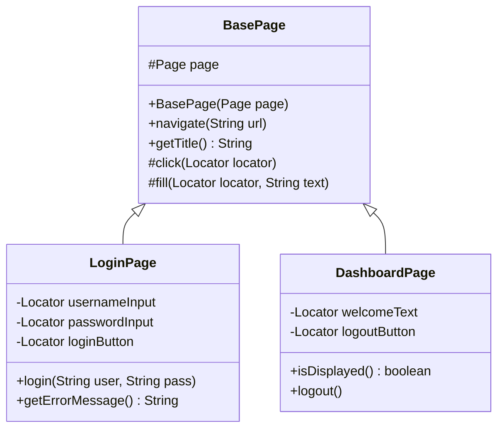

# Phase 1: Java Fundamentals - Hướng Dẫn Học Tập Chi Tiết

> **Thời gian học**: 2-3 tuần (2-3 giờ/ngày)  
> **Mục tiêu**: Nắm vững nền tảng Java cần thiết cho Automation Testing

---

## 📋 Mục Lục

1. [Cài Đặt Môi Trường](#-phần-1-cài-đặt-môi-trường)
2. [Công Cụ Lập Trình](#-phần-2-công-cụ-lập-trình)
3. [Java Syntax & Basics](#-phần-3-java-syntax--basics)
4. [OOP trong Java](#-phần-4-oop-trong-java)
5. [Collections Framework](#-phần-5-collections-framework)
6. [Exception Handling](#-phần-6-exception-handling)
7. [Bài Tập Thực Hành](#-phần-7-bài-tập-thực-hành)

---

## 🛠️ Phần 1: Cài Đặt Môi Trường

### 1.1 Cài Đặt Java Development Kit (JDK)

#### Tại sao cần JDK 17 hoặc 21?
- **LTS (Long Term Support)**: Được hỗ trợ lâu dài, ổn định
- **Tương thích Playwright**: Java Playwright yêu cầu JDK 8+ nhưng khuyến nghị JDK 17/21
- **Tính năng mới**: `var`, text blocks, records, pattern matching

#### Cài đặt trên macOS

```bash
# Cách 1: Sử dụng Homebrew (khuyến nghị)
brew install openjdk@21

# Thêm vào PATH (thêm dòng này vào ~/.zshrc hoặc ~/.bash_profile)
export JAVA_HOME=$(/usr/libexec/java_home -v 21)
export PATH=$JAVA_HOME/bin:$PATH

# Áp dụng thay đổi
source ~/.zshrc
```

```bash
# Cách 2: Tải từ Oracle hoặc Adoptium
# Truy cập: https://adoptium.net/
# Tải Eclipse Temurin JDK 21 cho macOS
# Chạy file .pkg để cài đặt
```

#### Cài đặt trên Windows

1. **Tải JDK**: Truy cập [Adoptium](https://adoptium.net/) → Download JDK 21
2. **Chạy installer**: Double-click file `.msi`
3. **Thiết lập Environment Variables**:
   ```
   Mở: Settings → System → About → Advanced system settings → Environment Variables
   
   Thêm JAVA_HOME:
   - Variable name: JAVA_HOME
   - Variable value: C:\Program Files\Eclipse Adoptium\jdk-21.x.x-hotspot
   
   Thêm vào Path:
   - %JAVA_HOME%\bin
   ```

#### Cài đặt trên Ubuntu/Linux

```bash
# Cập nhật package list
sudo apt update

# Cài đặt OpenJDK 21
sudo apt install openjdk-21-jdk

# Thiết lập JAVA_HOME trong ~/.bashrc
echo 'export JAVA_HOME=/usr/lib/jvm/java-21-openjdk-amd64' >> ~/.bashrc
echo 'export PATH=$JAVA_HOME/bin:$PATH' >> ~/.bashrc
source ~/.bashrc
```

#### Kiểm tra cài đặt thành công

```bash
# Kiểm tra version Java
java -version

# Output mong đợi:
# openjdk version "21.0.x" ...

# Kiểm tra Java Compiler
javac -version

# Kiểm tra JAVA_HOME
echo $JAVA_HOME
```

---

### 1.2 Cài Đặt Maven

Maven là build tool quan trọng để quản lý dependencies và build project.

#### Cài đặt trên macOS

```bash
# Sử dụng Homebrew
brew install maven

# Kiểm tra
mvn -version
```

#### Cài đặt trên Windows

1. Tải Maven từ [Apache Maven](https://maven.apache.org/download.cgi)
2. Giải nén vào `C:\Program Files\Apache\maven`
3. Thêm Environment Variables:
   ```
   M2_HOME: C:\Program Files\Apache\maven
   Path: %M2_HOME%\bin
   ```

#### Cài đặt trên Linux

```bash
sudo apt install maven
mvn -version
```

---

### 1.3 Cài Đặt Git

Git cần thiết cho version control và clone repositories.

#### macOS

```bash
# Git thường đã được cài sẵn, kiểm tra:
git --version

# Nếu chưa có:
brew install git
```

#### Windows

Tải từ [git-scm.com](https://git-scm.com/download/win) và cài đặt.

#### Linux

```bash
sudo apt install git
```

#### Cấu hình Git cơ bản

```bash
git config --global user.name "Your Name"
git config --global user.email "your.email@example.com"
```

---

## 💻 Phần 2: Công Cụ Lập Trình

### 2.1 IntelliJ IDEA (Khuyến nghị)

#### Tại sao chọn IntelliJ?
- **Code completion** thông minh
- **Refactoring** mạnh mẽ
- **Maven/Gradle integration** tốt
- **Debugging** visual
- **Plugin ecosystem** phong phú

#### Cài đặt IntelliJ IDEA Community Edition (Miễn phí)

1. Truy cập [JetBrains IntelliJ IDEA](https://www.jetbrains.com/idea/download/)
2. Tải **Community Edition** (free, đủ dùng cho automation testing)
3. Cài đặt theo hướng dẫn

#### Cài đặt trên macOS với Homebrew

```bash
brew install --cask intellij-idea-ce
```

#### Cấu hình ban đầu

1. **Mở IntelliJ** → Welcome screen
2. **Customize** → Chọn theme (Darcula recommended)
3. **Plugins** → Cài đặt plugins cần thiết:
   - **SonarLint**: Kiểm tra code quality
   - **Rainbow Brackets**: Dễ đọc nested code
   - **.ignore**: Quản lý .gitignore

#### Keyboard Shortcuts quan trọng

| Shortcut (Mac) | Shortcut (Windows) | Action |
|----------------|-------------------|--------|
| `⌘ + Space` | `Ctrl + Space` | Autocomplete |
| `⌘ + N` | `Alt + Insert` | Generate code |
| `⌘ + D` | `Ctrl + D` | Duplicate line |
| `⌘ + /` | `Ctrl + /` | Comment/Uncomment |
| `⌘ + ⌥ + L` | `Ctrl + Alt + L` | Format code |
| `⌘ + ⇧ + F10` | `Ctrl + Shift + F10` | Run current test |
| `⌘ + Click` | `Ctrl + Click` | Go to definition |
| `⌘ + ⇧ + F` | `Ctrl + Shift + F` | Find in project |
| `⌥ + Enter` | `Alt + Enter` | Quick fix / Suggestions |
| `⌘ + E` | `Ctrl + E` | Recent files |

---

### 2.2 Visual Studio Code (Alternative)

Nếu bạn thích editor nhẹ hơn:

```bash
# macOS
brew install --cask visual-studio-code

# Hoặc tải từ: https://code.visualstudio.com/
```

**Extensions cần thiết cho Java:**
- Extension Pack for Java (Microsoft)
- Maven for Java
- Test Runner for Java

---

### 2.3 Tạo Project Java Đầu Tiên

#### Tạo Maven Project trong IntelliJ

1. **File** → **New** → **Project**
2. Chọn **Maven Archetype**
3. Điền thông tin:
   - **Name**: `java-fundamentals`
   - **Location**: Chọn thư mục lưu
   - **JDK**: Chọn JDK 21
   - **Archetype**: `org.apache.maven.archetypes:maven-archetype-quickstart`
4. Click **Create**

#### Cấu trúc project Maven cơ bản

```
java-fundamentals/
├── pom.xml                  # Maven configuration
├── src/
│   ├── main/
│   │   └── java/
│   │       └── com/
│   │           └── example/
│   │               └── App.java
│   └── test/
│       └── java/
│           └── com/
│               └── example/
│                   └── AppTest.java
└── target/                  # Compiled output (auto-generated)
```

#### pom.xml cơ bản

```xml
<?xml version="1.0" encoding="UTF-8"?>
<project xmlns="http://maven.apache.org/POM/4.0.0"
         xmlns:xsi="http://www.w3.org/2001/XMLSchema-instance"
         xsi:schemaLocation="http://maven.apache.org/POM/4.0.0 
         http://maven.apache.org/xsd/maven-4.0.0.xsd">
    <modelVersion>4.0.0</modelVersion>

    <groupId>com.example</groupId>
    <artifactId>java-fundamentals</artifactId>
    <version>1.0-SNAPSHOT</version>
    <packaging>jar</packaging>

    <properties>
        <maven.compiler.source>21</maven.compiler.source>
        <maven.compiler.target>21</maven.compiler.target>
        <project.build.sourceEncoding>UTF-8</project.build.sourceEncoding>
    </properties>

    <dependencies>
        <!-- JUnit 5 for testing -->
        <dependency>
            <groupId>org.junit.jupiter</groupId>
            <artifactId>junit-jupiter</artifactId>
            <version>5.10.0</version>
            <scope>test</scope>
        </dependency>
    </dependencies>

    <build>
        <plugins>
            <plugin>
                <groupId>org.apache.maven.plugins</groupId>
                <artifactId>maven-surefire-plugin</artifactId>
                <version>3.2.2</version>
            </plugin>
        </plugins>
    </build>
</project>
```

#### Chạy Hello World

```java
// src/main/java/com/example/App.java
package com.example;

public class App {
    public static void main(String[] args) {
        System.out.println("Hello, Java Playwright World!");
    }
}
```

**Chạy chương trình:**
- Trong IntelliJ: Click nút ▶️ màu xanh bên cạnh `main`
- Hoặc dùng Terminal: `mvn compile exec:java -Dexec.mainClass="com.example.App"`

---

## 📖 Phần 3: Java Syntax & Basics

> **Thời gian học**: 3-4 ngày

### 3.1 Variables & Data Types

#### Primitive Types (Kiểu nguyên thủy)

```java
public class DataTypesDemo {
    public static void main(String[] args) {
        // Integer types
        byte smallNum = 127;           // -128 to 127
        short mediumNum = 32000;       // -32,768 to 32,767
        int number = 2147483647;       // -2^31 to 2^31-1
        long bigNum = 9223372036854775807L;  // Thêm 'L' ở cuối

        // Floating-point types
        float decimal = 3.14f;         // Thêm 'f' ở cuối
        double precise = 3.14159265359;

        // Other primitives
        boolean isActive = true;       // true hoặc false
        char letter = 'A';             // Một ký tự Unicode

        // Từ Java 10+: var (type inference)
        var message = "Hello";         // Java tự suy ra kiểu String
        var count = 100;               // Java tự suy ra kiểu int
    }
}
```

#### Reference Types (Kiểu tham chiếu)

```java
public class ReferenceTypesDemo {
    public static void main(String[] args) {
        // String - Chuỗi ký tự
        String name = "Automation Tester";
        String greeting = "Hello, " + name;

        // Một số String methods quan trọng
        int length = name.length();                    // 17
        boolean contains = name.contains("Test");      // true
        String upper = name.toUpperCase();             // "AUTOMATION TESTER"
        String lower = name.toLowerCase();             // "automation tester"
        String trimmed = "  hello  ".trim();           // "hello"
        boolean startsWith = name.startsWith("Auto"); // true
        String[] parts = name.split(" ");              // ["Automation", "Tester"]

        // Text Blocks (Java 15+) - Hữu ích cho HTML/JSON
        String html = """
            <html>
                <body>
                    <h1>Hello World</h1>
                </body>
            </html>
            """;
    }
}
```

> [!TIP]
> **Áp dụng trong Automation**: String được sử dụng rất nhiều - locators, URLs, test data, assertions messages.

---

### 3.2 Operators

```java
public class OperatorsDemo {
    public static void main(String[] args) {
        // Arithmetic Operators
        int a = 10, b = 3;
        System.out.println("a + b = " + (a + b));  // 13
        System.out.println("a - b = " + (a - b));  // 7
        System.out.println("a * b = " + (a * b));  // 30
        System.out.println("a / b = " + (a / b));  // 3 (integer division)
        System.out.println("a % b = " + (a % b));  // 1 (remainder)

        // Comparison Operators (trả về boolean)
        boolean isEqual = (a == b);      // false
        boolean notEqual = (a != b);     // true
        boolean greater = (a > b);       // true
        boolean lessEqual = (a <= b);    // false

        // Logical Operators
        boolean x = true, y = false;
        boolean and = x && y;            // false (AND)
        boolean or = x || y;             // true (OR)
        boolean not = !x;                // false (NOT)

        // String comparison - QUAN TRỌNG!
        String s1 = "Hello";
        String s2 = "Hello";
        String s3 = new String("Hello");

        // Dùng .equals() để so sánh nội dung String
        boolean correct = s1.equals(s2);     // true ✅
        boolean wrong = (s1 == s3);          // false ❌ (so sánh reference)
        
        // So sánh không phân biệt hoa thường
        boolean ignoreCase = s1.equalsIgnoreCase("HELLO"); // true
    }
}
```

> [!WARNING]
> **Lỗi phổ biến**: Dùng `==` để so sánh String thay vì `.equals()`. Trong Automation, điều này gây ra bugs khó phát hiện!

---

### 3.3 Control Flow

#### If-Else Statements

```java
public class ControlFlowDemo {
    
    // Ví dụ: Xác định loại test result
    public static String getTestStatus(int passedTests, int failedTests) {
        if (failedTests == 0) {
            return "ALL PASSED";
        } else if (failedTests <= 2) {
            return "MOSTLY PASSED";
        } else {
            return "NEEDS ATTENTION";
        }
    }

    // Ternary operator (if-else ngắn gọn)
    public static String getResult(boolean passed) {
        return passed ? "PASS" : "FAIL";
    }

    public static void main(String[] args) {
        System.out.println(getTestStatus(10, 0));  // ALL PASSED
        System.out.println(getTestStatus(10, 1));  // MOSTLY PASSED
        System.out.println(getResult(true));       // PASS
    }
}
```

#### Switch Statement

```java
public class SwitchDemo {
    
    // Switch truyền thống
    public static String getBrowserName(String browserCode) {
        String browserName;
        switch (browserCode) {
            case "CH":
                browserName = "Chrome";
                break;
            case "FF":
                browserName = "Firefox";
                break;
            case "SF":
                browserName = "Safari";
                break;
            default:
                browserName = "Unknown";
        }
        return browserName;
    }

    // Switch Expression (Java 14+) - Gọn hơn
    public static String getBrowserNameModern(String browserCode) {
        return switch (browserCode) {
            case "CH" -> "Chrome";
            case "FF" -> "Firefox";
            case "SF" -> "Safari";
            default -> "Unknown";
        };
    }
}
```

#### Loops

```java
public class LoopsDemo {
    public static void main(String[] args) {
        // For loop - Biết trước số lần lặp
        System.out.println("=== For Loop ===");
        for (int i = 1; i <= 5; i++) {
            System.out.println("Test case " + i);
        }

        // Enhanced for-each - Duyệt collection/array
        System.out.println("\n=== For-Each Loop ===");
        String[] browsers = {"Chrome", "Firefox", "Safari"};
        for (String browser : browsers) {
            System.out.println("Testing on: " + browser);
        }

        // While loop - Điều kiện không xác định
        System.out.println("\n=== While Loop ===");
        int retryCount = 0;
        boolean elementFound = false;
        while (!elementFound && retryCount < 3) {
            System.out.println("Attempt " + (retryCount + 1));
            // Giả lập tìm element
            retryCount++;
            if (retryCount == 2) elementFound = true;
        }

        // Do-While - Chạy ít nhất 1 lần
        System.out.println("\n=== Do-While Loop ===");
        int attempt = 0;
        do {
            attempt++;
            System.out.println("Retry attempt: " + attempt);
        } while (attempt < 3);
    }
}
```

> [!TIP]
> **Áp dụng trong Automation**:
> - `for`: Chạy test nhiều lần với data khác nhau
> - `for-each`: Duyệt qua danh sách elements
> - `while`: Retry mechanism khi element chưa xuất hiện

---

### 3.4 Arrays

```java
public class ArraysDemo {
    public static void main(String[] args) {
        // Khai báo và khởi tạo
        String[] testCases = {"TC001", "TC002", "TC003"};
        int[] scores = new int[5];  // Mảng 5 phần tử, mặc định = 0

        // Truy cập phần tử (index bắt đầu từ 0)
        String firstTC = testCases[0];  // "TC001"
        scores[0] = 100;
        
        // Độ dài mảng
        int length = testCases.length;  // 3

        // Duyệt mảng
        for (int i = 0; i < testCases.length; i++) {
            System.out.println("Index " + i + ": " + testCases[i]);
        }

        // For-each (khuyến nghị)
        for (String tc : testCases) {
            System.out.println("Running: " + tc);
        }

        // Mảng 2 chiều (matrix)
        String[][] testData = {
            {"user1", "pass1"},
            {"user2", "pass2"},
            {"admin", "admin123"}
        };
        
        for (String[] credentials : testData) {
            String username = credentials[0];
            String password = credentials[1];
            System.out.println("Login with: " + username + "/" + password);
        }
    }
}
```

---

### 3.5 Methods

```java
public class MethodsDemo {
    
    // Method không trả về giá trị (void)
    public static void printMessage(String message) {
        System.out.println("[LOG] " + message);
    }

    // Method trả về giá trị
    public static boolean isValidEmail(String email) {
        if (email == null || email.isEmpty()) {
            return false;
        }
        return email.contains("@") && email.contains(".");
    }

    // Method với nhiều parameters
    public static String buildUrl(String baseUrl, String path, String param) {
        return baseUrl + "/" + path + "?" + param;
    }

    // Method overloading - Cùng tên, khác parameters
    public static String buildUrl(String baseUrl, String path) {
        return baseUrl + "/" + path;
    }

    public static String buildUrl(String baseUrl) {
        return baseUrl;
    }

    // Varargs - Số lượng parameters không cố định
    public static int sum(int... numbers) {
        int total = 0;
        for (int num : numbers) {
            total += num;
        }
        return total;
    }

    public static void main(String[] args) {
        printMessage("Test started");
        
        System.out.println(isValidEmail("test@example.com"));  // true
        System.out.println(isValidEmail("invalid-email"));     // false
        
        // Overloaded methods
        System.out.println(buildUrl("https://api.com", "users", "id=1"));
        System.out.println(buildUrl("https://api.com", "users"));
        System.out.println(buildUrl("https://api.com"));
        
        // Varargs
        System.out.println(sum(1, 2, 3));           // 6
        System.out.println(sum(1, 2, 3, 4, 5));     // 15
    }
}
```

---

## 🏗️ Phần 4: OOP trong Java

> **Thời gian học**: 4-5 ngày

### 4.1 Class và Object

```java
// File: User.java
public class User {
    // Fields (thuộc tính)
    private String username;
    private String email;
    private String role;

    // Constructor - Mặc định
    public User() {
        this.role = "user";
    }

    // Constructor - Có parameters
    public User(String username, String email) {
        this.username = username;
        this.email = email;
        this.role = "user";
    }

    // Constructor - Đầy đủ
    public User(String username, String email, String role) {
        this.username = username;
        this.email = email;
        this.role = role;
    }

    // Getters
    public String getUsername() {
        return username;
    }

    public String getEmail() {
        return email;
    }

    public String getRole() {
        return role;
    }

    // Setters
    public void setUsername(String username) {
        this.username = username;
    }

    public void setEmail(String email) {
        this.email = email;
    }

    public void setRole(String role) {
        this.role = role;
    }

    // Methods
    public boolean isAdmin() {
        return "admin".equals(this.role);
    }

    @Override
    public String toString() {
        return "User{username='" + username + "', email='" + email + "', role='" + role + "'}";
    }
}
```

```java
// File: UserDemo.java
public class UserDemo {
    public static void main(String[] args) {
        // Tạo objects
        User user1 = new User();
        User user2 = new User("john", "john@example.com");
        User admin = new User("admin", "admin@example.com", "admin");

        // Sử dụng methods
        System.out.println(user2.getUsername());  // john
        System.out.println(admin.isAdmin());      // true
        System.out.println(admin);                // User{username='admin'...}

        // Thay đổi thuộc tính
        user1.setUsername("newuser");
        user1.setEmail("newuser@test.com");
    }
}
```

---

### 4.2 Encapsulation (Đóng gói)

```java
public class TestConfig {
    // Private fields - Không thể truy cập trực tiếp từ bên ngoài
    private String baseUrl;
    private int timeout;
    private boolean headless;

    // Constructor với validation
    public TestConfig(String baseUrl, int timeout) {
        setBaseUrl(baseUrl);
        setTimeout(timeout);
        this.headless = false;
    }

    // Getter với business logic
    public String getBaseUrl() {
        return baseUrl.endsWith("/") ? baseUrl : baseUrl + "/";
    }

    // Setter với validation
    public void setBaseUrl(String baseUrl) {
        if (baseUrl == null || baseUrl.isEmpty()) {
            throw new IllegalArgumentException("Base URL cannot be empty");
        }
        this.baseUrl = baseUrl;
    }

    public int getTimeout() {
        return timeout;
    }

    public void setTimeout(int timeout) {
        if (timeout < 0) {
            throw new IllegalArgumentException("Timeout cannot be negative");
        }
        this.timeout = timeout;
    }

    public boolean isHeadless() {
        return headless;
    }

    public void setHeadless(boolean headless) {
        this.headless = headless;
    }
}
```

---

### 4.3 Inheritance (Kế thừa)



```java
// File: BasePage.java
public abstract class BasePage {
    protected Page page;  // protected: subclass có thể truy cập

    public BasePage(Page page) {
        this.page = page;
    }

    public void navigate(String url) {
        page.navigate(url);
    }

    public String getTitle() {
        return page.title();
    }

    // Các method helper cho subclasses
    protected void click(Locator locator) {
        locator.click();
    }

    protected void fill(Locator locator, String text) {
        locator.fill(text);
    }

    protected String getText(Locator locator) {
        return locator.textContent();
    }
}
```

```java
// File: LoginPage.java
public class LoginPage extends BasePage {
    private final Locator usernameInput;
    private final Locator passwordInput;
    private final Locator loginButton;
    private final Locator errorMessage;

    public LoginPage(Page page) {
        super(page);  // Gọi constructor của BasePage
        this.usernameInput = page.locator("#username");
        this.passwordInput = page.locator("#password");
        this.loginButton = page.locator("#login-button");
        this.errorMessage = page.locator(".error-message");
    }

    public DashboardPage login(String username, String password) {
        fill(usernameInput, username);
        fill(passwordInput, password);
        click(loginButton);
        return new DashboardPage(page);
    }

    public String getErrorMessage() {
        return getText(errorMessage);
    }
}
```

---

### 4.4 Polymorphism (Đa hình)

#### Interface

```java
// File: Browser.java
public interface Browser {
    void open();
    void close();
    void navigate(String url);
    String getTitle();
}
```

```java
// File: ChromeBrowser.java
public class ChromeBrowser implements Browser {
    private Page page;
    private com.microsoft.playwright.Browser browser;

    @Override
    public void open() {
        Playwright playwright = Playwright.create();
        browser = playwright.chromium().launch();
        page = browser.newPage();
    }

    @Override
    public void close() {
        browser.close();
    }

    @Override
    public void navigate(String url) {
        page.navigate(url);
    }

    @Override
    public String getTitle() {
        return page.title();
    }
}
```

```java
// File: FirefoxBrowser.java
public class FirefoxBrowser implements Browser {
    private Page page;
    private com.microsoft.playwright.Browser browser;

    @Override
    public void open() {
        Playwright playwright = Playwright.create();
        browser = playwright.firefox().launch();
        page = browser.newPage();
    }

    // ... similar implementations
}
```

```java
// Sử dụng polymorphism
public class BrowserTest {
    public static void runTest(Browser browser) {
        browser.open();
        browser.navigate("https://example.com");
        System.out.println("Title: " + browser.getTitle());
        browser.close();
    }

    public static void main(String[] args) {
        // Có thể truyền bất kỳ implementation nào
        runTest(new ChromeBrowser());
        runTest(new FirefoxBrowser());
    }
}
```

#### Abstract Class

```java
// File: AbstractPage.java
public abstract class AbstractPage {
    protected Page page;

    public AbstractPage(Page page) {
        this.page = page;
    }

    // Concrete method - có implementation
    public void waitForPageLoad() {
        page.waitForLoadState();
    }

    // Abstract method - bắt buộc subclass implement
    public abstract boolean isLoaded();
    
    public abstract String getPageUrl();
}
```

```java
// File: HomePage.java
public class HomePage extends AbstractPage {
    public HomePage(Page page) {
        super(page);
    }

    @Override
    public boolean isLoaded() {
        return page.locator("#home-banner").isVisible();
    }

    @Override
    public String getPageUrl() {
        return "/home";
    }
}
```

---

### 4.5 Composition (Has-A Relationship)

```java
// File: Header.java - Component
public class Header {
    private final Page page;
    private final Locator logo;
    private final Locator searchBox;
    private final Locator userMenu;

    public Header(Page page) {
        this.page = page;
        this.logo = page.locator("#logo");
        this.searchBox = page.locator("#search");
        this.userMenu = page.locator("#user-menu");
    }

    public void search(String keyword) {
        searchBox.fill(keyword);
        searchBox.press("Enter");
    }

    public void clickLogo() {
        logo.click();
    }

    public void openUserMenu() {
        userMenu.click();
    }
}
```

```java
// File: HomePage.java - Sử dụng composition
public class HomePage extends BasePage {
    private final Header header;  // Has-A relationship
    private final Locator featuredProducts;

    public HomePage(Page page) {
        super(page);
        this.header = new Header(page);  // Composition
        this.featuredProducts = page.locator(".featured-products");
    }

    public Header getHeader() {
        return header;
    }

    public void searchProduct(String keyword) {
        header.search(keyword);
    }
}
```

---

## 📚 Phần 5: Collections Framework

> **Thời gian học**: 3-4 ngày

### 5.1 List

```java
import java.util.ArrayList;
import java.util.Arrays;
import java.util.List;

public class ListDemo {
    public static void main(String[] args) {
        // ArrayList - Dynamic array
        List<String> browsers = new ArrayList<>();
        
        // Thêm phần tử
        browsers.add("Chrome");
        browsers.add("Firefox");
        browsers.add("Safari");
        browsers.add(1, "Edge");  // Thêm vào vị trí index 1

        // Truy cập phần tử
        String first = browsers.get(0);        // Chrome
        int size = browsers.size();            // 4
        boolean hasChrome = browsers.contains("Chrome");  // true

        // Duyệt List
        for (String browser : browsers) {
            System.out.println("Testing: " + browser);
        }

        // Xóa phần tử
        browsers.remove("Safari");
        browsers.remove(0);  // Xóa theo index

        // Khởi tạo với giá trị sẵn
        List<String> testCases = Arrays.asList("TC001", "TC002", "TC003");
        
        // List có thể modify
        List<String> modifiableList = new ArrayList<>(Arrays.asList("a", "b", "c"));
        
        // Tìm kiếm
        int index = browsers.indexOf("Firefox");  // -1 nếu không tìm thấy
        
        // Kiểm tra rỗng
        boolean isEmpty = browsers.isEmpty();
        
        // Xóa tất cả
        browsers.clear();
    }
}
```

**Ví dụ áp dụng trong Automation:**

```java
public class DropdownTest {
    public static List<String> getDropdownOptions(Page page, String selector) {
        List<String> options = new ArrayList<>();
        Locator optionElements = page.locator(selector + " option");
        
        int count = optionElements.count();
        for (int i = 0; i < count; i++) {
            options.add(optionElements.nth(i).textContent());
        }
        
        return options;
    }

    public static void main(String[] args) {
        // Verify dropdown có đúng options
        List<String> expectedOptions = Arrays.asList("Option 1", "Option 2", "Option 3");
        List<String> actualOptions = getDropdownOptions(page, "#my-dropdown");
        
        if (expectedOptions.equals(actualOptions)) {
            System.out.println("Dropdown options match!");
        }
    }
}
```

---

### 5.2 Map

```java
import java.util.HashMap;
import java.util.LinkedHashMap;
import java.util.Map;

public class MapDemo {
    public static void main(String[] args) {
        // HashMap - Key-Value pairs
        Map<String, String> credentials = new HashMap<>();
        
        // Thêm cặp key-value
        credentials.put("username", "testuser");
        credentials.put("password", "secret123");
        credentials.put("email", "test@example.com");

        // Truy cập value bằng key
        String username = credentials.get("username");      // testuser
        String missing = credentials.get("nonexistent");    // null
        String withDefault = credentials.getOrDefault("nonexistent", "default");

        // Kiểm tra key/value tồn tại
        boolean hasUsername = credentials.containsKey("username");   // true
        boolean hasValue = credentials.containsValue("secret123");   // true

        // Duyệt Map
        for (Map.Entry<String, String> entry : credentials.entrySet()) {
            System.out.println(entry.getKey() + " = " + entry.getValue());
        }

        // Chỉ duyệt keys
        for (String key : credentials.keySet()) {
            System.out.println("Key: " + key);
        }

        // Chỉ duyệt values
        for (String value : credentials.values()) {
            System.out.println("Value: " + value);
        }

        // Xóa
        credentials.remove("email");

        // LinkedHashMap - Giữ thứ tự insert
        Map<String, Integer> orderedMap = new LinkedHashMap<>();
        orderedMap.put("first", 1);
        orderedMap.put("second", 2);
        orderedMap.put("third", 3);
    }
}
```

**Ví dụ áp dụng trong Automation:**

```java
public class TestDataManager {
    private Map<String, Map<String, String>> testUsers;

    public TestDataManager() {
        testUsers = new HashMap<>();
        
        // User thường
        Map<String, String> normalUser = new HashMap<>();
        normalUser.put("username", "user1");
        normalUser.put("password", "pass123");
        normalUser.put("role", "user");
        testUsers.put("normal", normalUser);

        // Admin
        Map<String, String> adminUser = new HashMap<>();
        adminUser.put("username", "admin");
        adminUser.put("password", "admin123");
        adminUser.put("role", "admin");
        testUsers.put("admin", adminUser);
    }

    public Map<String, String> getUser(String type) {
        return testUsers.get(type);
    }

    public String getUsername(String type) {
        return testUsers.get(type).get("username");
    }
}
```

---

### 5.3 Set

```java
import java.util.HashSet;
import java.util.LinkedHashSet;
import java.util.Set;
import java.util.TreeSet;

public class SetDemo {
    public static void main(String[] args) {
        // HashSet - Không trùng lặp, không theo thứ tự
        Set<String> uniqueTags = new HashSet<>();
        uniqueTags.add("smoke");
        uniqueTags.add("regression");
        uniqueTags.add("smoke");  // Không thêm được vì đã tồn tại

        System.out.println(uniqueTags.size());  // 2

        // LinkedHashSet - Giữ thứ tự insert
        Set<String> orderedTags = new LinkedHashSet<>();
        orderedTags.add("first");
        orderedTags.add("second");
        orderedTags.add("third");

        // TreeSet - Tự động sort
        Set<String> sortedTags = new TreeSet<>();
        sortedTags.add("zebra");
        sortedTags.add("apple");
        sortedTags.add("mango");
        // Output: [apple, mango, zebra]

        // Kiểm tra tồn tại
        boolean hasSmoke = uniqueTags.contains("smoke");  // true

        // Operations giữa các Set
        Set<String> set1 = new HashSet<>(Set.of("a", "b", "c"));
        Set<String> set2 = new HashSet<>(Set.of("b", "c", "d"));

        // Union
        Set<String> union = new HashSet<>(set1);
        union.addAll(set2);  // [a, b, c, d]

        // Intersection
        Set<String> intersection = new HashSet<>(set1);
        intersection.retainAll(set2);  // [b, c]

        // Difference
        Set<String> difference = new HashSet<>(set1);
        difference.removeAll(set2);  // [a]
    }
}
```

**Ví dụ áp dụng trong Automation:**

```java
public class DuplicateChecker {
    public static boolean hasDuplicates(List<String> items) {
        Set<String> uniqueItems = new HashSet<>(items);
        return uniqueItems.size() != items.size();
    }

    public static Set<String> findDuplicates(List<String> items) {
        Set<String> seen = new HashSet<>();
        Set<String> duplicates = new HashSet<>();
        
        for (String item : items) {
            if (!seen.add(item)) {
                duplicates.add(item);
            }
        }
        return duplicates;
    }
}
```

---

### 5.4 Stream API (Java 8+)

```java
import java.util.Arrays;
import java.util.List;
import java.util.stream.Collectors;

public class StreamDemo {
    public static void main(String[] args) {
        List<String> testCases = Arrays.asList(
            "TC001_Login_Valid",
            "TC002_Login_Invalid",
            "TC003_Checkout_Success",
            "TC004_Checkout_Fail",
            "TC005_Search_Product"
        );

        // Filter - Lọc theo điều kiện
        List<String> loginTests = testCases.stream()
            .filter(tc -> tc.contains("Login"))
            .collect(Collectors.toList());
        // [TC001_Login_Valid, TC002_Login_Invalid]

        // Map - Transform elements
        List<String> upperCaseTests = testCases.stream()
            .map(String::toUpperCase)
            .collect(Collectors.toList());

        // Count
        long checkoutCount = testCases.stream()
            .filter(tc -> tc.contains("Checkout"))
            .count();  // 2

        // AnyMatch / AllMatch / NoneMatch
        boolean hasLoginTest = testCases.stream()
            .anyMatch(tc -> tc.contains("Login"));  // true

        boolean allStartWithTC = testCases.stream()
            .allMatch(tc -> tc.startsWith("TC"));   // true

        // FindFirst
        String firstLogin = testCases.stream()
            .filter(tc -> tc.contains("Login"))
            .findFirst()
            .orElse("Not found");

        // ForEach
        testCases.stream()
            .filter(tc -> tc.contains("Success"))
            .forEach(System.out::println);

        // Sorted
        List<String> sorted = testCases.stream()
            .sorted()
            .collect(Collectors.toList());

        // Chaining multiple operations
        List<String> result = testCases.stream()
            .filter(tc -> tc.contains("Login"))
            .map(String::toLowerCase)
            .sorted()
            .collect(Collectors.toList());
    }
}
```

---

## ⚠️ Phần 6: Exception Handling

> **Thời gian học**: 2 ngày

### 6.1 Try-Catch-Finally

```java
public class ExceptionDemo {
    
    public static void basicTryCatch() {
        try {
            int result = 10 / 0;  // ArithmeticException
        } catch (ArithmeticException e) {
            System.out.println("Error: Division by zero");
            System.out.println("Message: " + e.getMessage());
        }
    }

    public static void multipleCatch() {
        try {
            String[] arr = {"a", "b"};
            System.out.println(arr[5]);  // ArrayIndexOutOfBoundsException
        } catch (ArrayIndexOutOfBoundsException e) {
            System.out.println("Index out of bounds: " + e.getMessage());
        } catch (NullPointerException e) {
            System.out.println("Null pointer: " + e.getMessage());
        } catch (Exception e) {
            System.out.println("General error: " + e.getMessage());
        }
    }

    public static void withFinally() {
        Browser browser = null;
        try {
            browser = playwright.chromium().launch();
            // Test code
        } catch (Exception e) {
            System.out.println("Test failed: " + e.getMessage());
        } finally {
            // Luôn chạy, dù có exception hay không
            if (browser != null) {
                browser.close();
            }
        }
    }

    // Multi-catch (Java 7+)
    public static void multiCatch() {
        try {
            // code
        } catch (IOException | SQLException e) {
            System.out.println("IO or SQL error: " + e.getMessage());
        }
    }
}
```

### 6.2 Try-with-Resources

```java
// Tự động đóng resources - Best practice cho Playwright
public class TryWithResourcesDemo {
    
    public static void playwrightExample() {
        try (Playwright playwright = Playwright.create()) {
            Browser browser = playwright.chromium().launch();
            Page page = browser.newPage();
            page.navigate("https://example.com");
            // Playwright tự động được đóng khi ra khỏi block
        } catch (Exception e) {
            System.out.println("Error: " + e.getMessage());
        }
        // Không cần gọi playwright.close() manually
    }

    public static void fileExample() {
        try (BufferedReader reader = new BufferedReader(
                new FileReader("testdata.txt"))) {
            String line;
            while ((line = reader.readLine()) != null) {
                System.out.println(line);
            }
        } catch (IOException e) {
            System.out.println("File error: " + e.getMessage());
        }
        // File tự động được đóng
    }
}
```

### 6.3 Throwing Exceptions

```java
public class ThrowDemo {
    
    // Throws declaration
    public static void validateUrl(String url) throws IllegalArgumentException {
        if (url == null || url.isEmpty()) {
            throw new IllegalArgumentException("URL cannot be empty");
        }
        if (!url.startsWith("http")) {
            throw new IllegalArgumentException("URL must start with http");
        }
    }

    public static void main(String[] args) {
        try {
            validateUrl("");
        } catch (IllegalArgumentException e) {
            System.out.println("Validation failed: " + e.getMessage());
        }
    }
}
```

### 6.4 Custom Exceptions

```java
// File: ElementNotFoundException.java
public class ElementNotFoundException extends RuntimeException {
    private String selector;

    public ElementNotFoundException(String selector) {
        super("Element not found: " + selector);
        this.selector = selector;
    }

    public ElementNotFoundException(String selector, Throwable cause) {
        super("Element not found: " + selector, cause);
        this.selector = selector;
    }

    public String getSelector() {
        return selector;
    }
}

// File: PageLoadException.java
public class PageLoadException extends Exception {
    private String url;
    private int timeout;

    public PageLoadException(String url, int timeout) {
        super(String.format("Page failed to load: %s (timeout: %dms)", url, timeout));
        this.url = url;
        this.timeout = timeout;
    }
}
```

```java
// Sử dụng custom exception
public class PageHelper {
    
    public static void waitForElement(Page page, String selector, int timeout) 
            throws ElementNotFoundException {
        try {
            page.waitForSelector(selector, 
                new Page.WaitForSelectorOptions().setTimeout(timeout));
        } catch (TimeoutError e) {
            throw new ElementNotFoundException(selector, e);
        }
    }
}
```

---

## 💪 Phần 7: Bài Tập Thực Hành

### Bài tập 1: Email Validator

Tạo class `EmailValidator` với các method:
- `isValidFormat(String email)`: Kiểm tra email hợp lệ
- `getDomain(String email)`: Lấy domain từ email
- `isCompanyEmail(String email, String companyDomain)`: Kiểm tra email thuộc công ty

```java
// Solution structure
public class EmailValidator {
    public boolean isValidFormat(String email) {
        // TODO: Implement
        return false;
    }

    public String getDomain(String email) {
        // TODO: Implement
        return null;
    }

    public boolean isCompanyEmail(String email, String companyDomain) {
        // TODO: Implement
        return false;
    }
}
```

---

### Bài tập 2: Test Data Manager

Tạo class quản lý test data với:
- Lưu trữ nhiều users (Map)
- Thêm/xóa/lấy user
- Lấy tất cả users có role cụ thể (Stream)

```java
public class TestDataManager {
    private Map<String, User> users;

    public TestDataManager() {
        users = new HashMap<>();
    }

    public void addUser(String id, User user) {
        // TODO
    }

    public User getUser(String id) {
        // TODO
        return null;
    }

    public void removeUser(String id) {
        // TODO
    }

    public List<User> getUsersByRole(String role) {
        // TODO: Use Stream API
        return null;
    }
}
```

---

### Bài tập 3: Simple Page Object

Tạo Page Object pattern cơ bản (chưa cần Playwright):

```java
// BasePage.java
public abstract class BasePage {
    protected String pageUrl;
    protected String pageTitle;

    public abstract boolean isLoaded();
    public abstract void waitForPageLoad();
}

// LoginPage.java
public class LoginPage extends BasePage {
    // Implement login functionality
}

// Tạo test sử dụng các Page Objects
```

---

### Bài tập 4: Configuration Reader

Tạo class đọc configuration từ file properties:

```java
public class ConfigReader {
    private Properties properties;

    public ConfigReader(String filePath) {
        // Load properties file
    }

    public String get(String key) {
        // Get value by key
        return null;
    }

    public int getInt(String key) {
        // Get value as integer
        return 0;
    }

    public boolean getBoolean(String key) {
        // Get value as boolean
        return false;
    }
}
```

---

## ✅ Checklist Hoàn Thành Phase 1

### Môi trường & Công cụ
- [ ] JDK 17/21 đã cài đặt và cấu hình
- [ ] Maven đã cài đặt
- [ ] Git đã cài đặt và cấu hình
- [ ] IntelliJ IDEA (hoặc VS Code) đã cài đặt
- [ ] Tạo được Maven project mới
- [ ] Chạy được Hello World

### Java Basics
- [ ] Hiểu các primitive types và reference types
- [ ] Sử dụng thành thạo operators
- [ ] Viết được if/else, switch statements
- [ ] Sử dụng các loại loops (for, while, for-each)
- [ ] Làm việc với arrays
- [ ] Viết và gọi methods

### OOP
- [ ] Tạo class với fields, constructors, methods
- [ ] Áp dụng encapsulation (private fields, getters/setters)
- [ ] Sử dụng inheritance (extends, super)
- [ ] Hiểu và implement interfaces
- [ ] Sử dụng abstract classes
- [ ] Áp dụng composition

### Collections
- [ ] Sử dụng List (ArrayList)
- [ ] Sử dụng Map (HashMap)
- [ ] Sử dụng Set (HashSet)
- [ ] Cơ bản về Stream API

### Exception Handling
- [ ] Try-catch-finally
- [ ] Try-with-resources
- [ ] Throwing exceptions
- [ ] Custom exceptions

---

## 📚 Tài Liệu Tham Khảo

### Online Resources
- [W3Schools Java Tutorial](https://www.w3schools.com/java/)
- [Oracle Java Tutorials](https://docs.oracle.com/javase/tutorial/)
- [Baeldung Java Guides](https://www.baeldung.com/java-tutorial)

### Video Courses (Miễn phí)
- [Java Full Course - freeCodeCamp](https://www.youtube.com/watch?v=xk4_1vDrzzo)
- [Java Tutorial for Beginners - Programming with Mosh](https://www.youtube.com/watch?v=eIrMbAQSU34)

### Practice
- [Exercism Java Track](https://exercism.org/tracks/java)
- [HackerRank Java](https://www.hackerrank.com/domains/java)
- [LeetCode](https://leetcode.com/) - Thực hành algorithms

---

> [!IMPORTANT]
> **Tiếp theo**: Sau khi hoàn thành Phase 1, bạn sẽ chuyển sang **Phase 2: Java Ecosystem & Testing Tools** để học Maven chi tiết, IDE setup nâng cao, và JUnit 5 fundamentals.

---

*Tài liệu được tạo: 2026-01-09*
